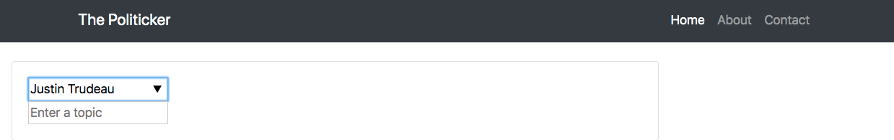

# The Politicker

What are your representatives (actually) saying?

## What is The Politicker?

In June of 2016, the United Kingdom chose to leave the European Union as part of the 'Brexit' referendum, with [51.9% voting in favour of leaving](https://www.bbc.com/news/politics/eu_referendum/results). Since then, many follow-up polls show that voters have shifted towards remaining in the Union. While the reasons for this shift are complicated, post-referendum surveys suggest at least part of the explanation: voters did not fully understand the implications of a Brexit. The information available to their Members of Parliament did not reach them effectively. In Canada, a country with the same system of government, what can be done to preempt (or bridge) such information gaps?

The Politicker is a web application that helps bridge the information gap between what our political representatives are discussing and what we, as voters and businesses, perceive to be the discussion. In Canadian federal politics, parliamentary sessions are the main forum for political debate and decision-making. Although transcripts of sessions are publicly available, coverage of a given topic can span several days and many speeches, making it challenging to follow. The Politicker automates text summarization of these transcripts, making it faster and easier for Canadians to follow the discussions taking place on their behalf.

## How do you use The Politicker?

From the home page...

...enter the name of a Canadian Member of Parliament (MP):

Next, enter a topic. Autocomplete suggestions are limited to those discussed by the selected MP (note that autocomplete functionality may not work for all browsers):

Soon afterwards, you will see a summary of all that he or she said on that topic during parliamentary debates:

The highlighting indicates chronology, with the brightest sentence coming from the most recent speech. Underneath the summary, you can explore all of the speeches that were considered in creating the summary. You can also click on a sentence in the summary to see its source speech.

## How does The Politicker work?

The Politicker makes use of Hansard transcripts of Canadian federal parliamentary debates. These transcripts are publicly available through the House of Commons [website](https://www.ourcommons.ca/en).

There are two input fields on the home page of The Politicker. In the first field, the user enters the name of a Member of Parliament (MP), with autocomplete suggestions available if needed. The page then updates with an image of the selected MP.

In the second field, the user enters a topic of interest, where autocomplete suggestions are limited to those discussed by the MP in the first input field. Based on the entered topic, the server concatenates all speeches by the selected MP, in reverse chronological order. It then tokenizes the speeches into sentences, and passes the tokens to an extractive summarization algorithm. Note that an extractive summary consists of sentences that appear in the original speeches. This is in contrast to an abstractive summary, which consists partly (or entirely) of newly generated sentences. The extractive approach seemed less likely to 'put words in someone's mouth'.

The Politicker's extractive algorithm performs four steps: 1) Encoding the tokenized sentences using a language representation model called Bidirectional Encoder Representations from Transformers, or BERT (see Appendix below for more information), 2) applying K-Means clustering to the encoded tokens, 3) selecting the sentences closest to the centroid of each cluster and, 4) concatenating them to form a summary. The server then updates the HTML (with the help of Javascript functions) to include the summary, alongside all of the speeches that were provided to the summarization algorithm (in reverse chronological order).

## Appendix

### BERT
The original BERT [publication](https://arxiv.org/abs/1810.04805).

### Data Sources
Lipad for [Hansard transcripts](https://www.lipad.ca/data/).

Kaggle for [BBC News Summaries](https://www.kaggle.com/pariza/bbc-news-summary).

### Evaluation
[Publication](https://www.aclweb.org/anthology/W04-1013.pdf) describing the original ROUGE metrics.

[Sumeval](https://github.com/chakki-works/sumeval) for computing [ROUGE](https://en.wikipedia.org/wiki/ROUGE_%28metric%29) scores.
